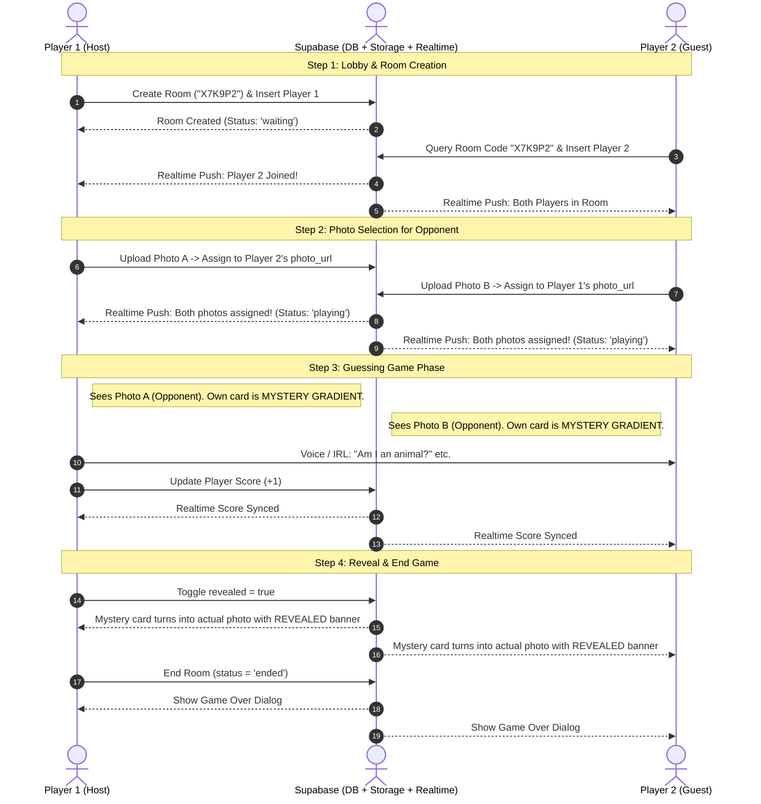

# 🎮 GUESS GAME — AI Agent & Developer Complete Reference Manual

> **Purpose of this document:** This file serves as the single source of truth (SSOT) and comprehensive architectural specification for any **AI Agent**, **pair programmer**, or **software engineer** interacting with, maintaining, or expanding this Flutter codebase.

---

## 📌 1. Project Overview & Core Game Concept

**Guess Game** is a real-time, cross-platform 2-player multiplayer party guessing game (inspired by the classic *"Heads Up!"* / *"Who Am I?"* party game mechanic).

### 🎯 Core Gameplay Mechanics:
1. **Lobby & Room Creation:**
   - **Player 1 (Host)** enters their nickname and taps **"Create Room"**. The app generates a unique 6-character room code (e.g. `X7K9P2`) and registers the room in Supabase.
   - **Player 2** opens the app on another phone, tablet, or web browser, enters their nickname and the room code, and joins the room.
2. **Headband Photo Selection ("Pick for Your Opponent"):**
   - Each player selects/takes a photo from their device gallery or camera.
   - **Crucial Rule:** The photo you choose is uploaded and assigned to **your opponent** (it represents the secret photo on the opponent's "head").
3. **Guessing Phase & Mystery Card UI:**
   - **On Player 1's screen:** They can clearly see the photo they assigned to Player 2, but their own photo is hidden behind a glowing animated **"MYSTERY PHOTO"** card.
   - **On Player 2's screen:** They can clearly see the photo assigned to Player 1, while their own photo is hidden.
   - Both players ask each other yes/no questions in real life / voice to deduce what photo is on their head.
4. **Host Controls & Scoring:**
   - **Score Counter:** The host has `+` and `-` buttons in the real-time scoreboard to award points when a player successfully guesses their secret card.
   - **Reveal / Hide Photos:** The host has a top-bar **"Reveal"** toggle button. When pressed, both players' secret cards flip open and show their actual photos with a **"REVEALED!"** badge. The host can toggle it back to **"Hide"** to start the next guessing round.
   - **End Game:** The host can end the match at any time, triggering a synchronized **"Game Over"** victory dialog with final scores and winner announcement for both players.

---

## 🏗️ 2. Architectural Principles & Layer Structure

The project strictly follows a **clean, unbloated 4-layer architecture** without unnecessary enterprise abstractions (no Use Cases or Entities layers):

```
┌──────────────────────────────────────────────────────────┐
│                   PRESENTATION LAYER                     │
│    Screens, Dialogs, Reusable Widgets, Theme, Layouts     │
└────────────────────────────┬─────────────────────────────┘
                             │ Watches / Calls
┌────────────────────────────▼─────────────────────────────┐
│                    CONTROLLERS LAYER                     │
│       Riverpod StateNotifiers (Auth, Lobby, Game, Score) │
└────────────────────────────┬─────────────────────────────┘
                             │ Calls
┌────────────────────────────▼─────────────────────────────┐
│                   REPOSITORIES LAYER                     │
│    Abstract / Concrete Data Access & Coordination Logic  │
└────────────────────────────┬─────────────────────────────┘
                             │ Calls
┌────────────────────────────▼─────────────────────────────┐
│                  DATA SOURCES LAYER                      │
│     Direct Supabase SDK Calls, Realtime Streams, Storage │
└──────────────────────────────────────────────────────────┘
```

### Layer Breakdown:
1. **`lib/data/models/`**: Pure Dart data transfer objects (`RoomModel`, `PlayerModel`) with `toJson()`, `fromJson()`, `copyWith()`, value equality, and helper getters.
2. **`lib/data/data_sources/`**: Low-level clients interacting with Supabase tables (`rooms`, `players`), Supabase Realtime Channels, and Supabase Storage (`game-photos` bucket).
3. **`lib/data/repositories/`**: Clean repository interfaces and implementations coordinating data sources and business validation.
4. **`lib/controllers/`**: Riverpod `StateNotifier` classes exposing immutable state classes (`GameState`, `LobbyState`, `AuthState`) to the UI.
5. **`lib/presentation/`**: Reactive Flutter UI layer using `ConsumerWidget` / `ConsumerStatefulWidget`, GoRouter navigation, responsive breakpoints, and dark cyberpunk styling.

---

## 📁 3. Complete File & Directory Map

```
lib/
├── app.dart                                # Root MaterialApp, GoRouter setup, AppTheme injection
├── main.dart                               # Supabase initialization & runApp with ProviderScope
├── controllers/
│   ├── auth_controller.dart                # Anonymous authentication & local user ID persistence
│   ├── game_controller.dart                # Core realtime sync (Room & Players), photo upload, reveal & end controls
│   ├── lobby_controller.dart               # Room creation, room code lookup & joining logic
│   └── score_controller.dart               # Host real-time score increment & decrement actions
├── core/
│   ├── constants/
│   │   └── supabase_constants.dart         # Supabase URL, Anon Key, table names, storage bucket IDs
│   ├── theme/
│   │   └── app_theme.dart                  # Dark theme colors (indigo, neon cyan, purple, rose), gradients, card styles
│   └── utils/
│       └── code_generator.dart             # Generates clean 6-character uppercase alphanumeric room codes
├── data/
│   ├── data_sources/
│   │   ├── player_remote_data_source.dart  # Supabase CRUD & Realtime streams for `players` table
│   │   ├── room_remote_data_source.dart    # Supabase CRUD & Realtime streams for `rooms` table
│   │   └── storage_remote_data_source.dart # Supabase Storage uploads to `game-photos` bucket
│   ├── models/
│   │   ├── player_model.dart               # PlayerModel (id, roomId, userId, displayName, photoUrl, score, isHost)
│   │   └── room_model.dart                 # RoomModel (id, roomCode, hostId, status, revealed, createdAt)
│   └── repositories/
│       ├── player_repository.dart          # PlayerRepository interface + Riverpod provider
│       ├── room_repository.dart            # RoomRepository interface + Riverpod provider
│       └── storage_repository.dart         # StorageRepository interface + Riverpod provider
└── presentation/
    ├── dialogs/
    │   ├── end_game_dialog.dart            # Confirmation popup before host terminates a room
    │   └── game_over_dialog.dart           # Post-match victory scoreboard & winner announcement
    ├── screens/
    │   ├── game_screen.dart                # Main 2-player arena (Mobile & Desktop layouts, realtime sync)
    │   └── lobby_screen.dart               # Create Room / Join Room interactive tabs
    └── widgets/
        ├── photo_upload_sheet.dart         # Bottom sheet / modal for gallery/camera image picking
        ├── player_card.dart                # Dynamic player card (Mystery gradient vs revealed photo)
        ├── responsive_layout.dart          # Dynamic LayoutBuilder (Mobile vs Tablet/Desktop dual columns)
        ├── room_code_badge.dart            # Glowing clickable badge to view & copy room code
        └── score_board.dart                # Live score indicator with host-only + / - controls
```

---

## 🗄️ 4. Supabase Database Schema & Storage

The backend is hosted on **Supabase** using PostgreSQL, Row Level Security (RLS), Realtime Publications, and Supabase Storage.

### Tables & SQL Definition (`supabase_schema.sql`):

#### 1. `rooms` Table
| Column | Type | Constraints | Description |
|---|---|---|---|
| `id` | `uuid` | `PRIMARY KEY, DEFAULT gen_random_uuid()` | Unique room ID |
| `room_code` | `text` | `UNIQUE NOT NULL` | 6-character room code (e.g. `ABC123`) |
| `host_id` | `text` | `NOT NULL` | Anonymous User ID of room creator |
| `status` | `text` | `NOT NULL DEFAULT 'waiting'` | State: `'waiting'`, `'playing'`, `'ended'` |
| `revealed` | `boolean`| `DEFAULT false` | When `true`, both mystery photos are visible |
| `created_at` | `timestamptz` | `DEFAULT now()` | Room creation timestamp |

#### 2. `players` Table
| Column | Type | Constraints | Description |
|---|---|---|---|
| `id` | `uuid` | `PRIMARY KEY, DEFAULT gen_random_uuid()` | Unique player record ID |
| `room_id` | `uuid` | `REFERENCES rooms(id) ON DELETE CASCADE` | Associated room |
| `user_id` | `text` | `NOT NULL` | Anonymous User ID of this player |
| `display_name`| `text` | `NOT NULL` | Display nickname |
| `photo_url` | `text` | `NULLABLE` | Image URL assigned to this player |
| `score` | `int` | `DEFAULT 0` | Current round score |
| `is_host` | `boolean` | `DEFAULT false` | Is this player the room host |
| `joined_at` | `timestamptz` | `DEFAULT now()` | Timestamp when joined |
| *Constraint* | `UNIQUE(room_id, user_id)` | — | Max 1 entry per user per room |

#### 3. Storage Bucket: `game-photos`
- **Visibility:** Public (`public: true`)
- **Path structure:** `rooms/{roomId}/{timestamp}_{filename}.jpg`
- **RLS Policies:** Open SELECT and INSERT policies for all authenticated/anonymous players.

#### 4. Realtime Replication
Supabase Realtime is enabled on both tables:
```sql
ALTER PUBLICATION supabase_realtime ADD TABLE public.rooms;
ALTER PUBLICATION supabase_realtime ADD TABLE public.players;
```

---

## ⚡ 5. State Management & Real-Time Sync Breakdown

### Riverpod Architecture:
- **`authControllerProvider` (`StateNotifierProvider<AuthNotifier, AuthState>`)**:
  - Automatically handles `Supabase.instance.client.auth.signInAnonymously()`.
  - Fallback to UUID-based device storage if anonymous auth fails.
  - Exposes `userId`, `displayName`, `isAuthenticated`.
- **`lobbyControllerProvider` (`StateNotifierProvider<LobbyNotifier, LobbyState>`)**:
  - Exposes `createRoom(displayName)` and `joinRoom(roomCode, displayName)`.
- **`gameControllerProvider.family<GameNotifier, GameState, String>(roomId)`**:
  - Maintains **two active Supabase Realtime streams**:
    1. `_roomRepo.streamRoom(roomId)`: Listens for status changes (`waiting` ➔ `playing` ➔ `ended`) and `revealed` flag toggles.
    2. `_playerRepo.streamPlayers(roomId)`: Listens for player joins, photo URL updates, and score changes.
  - Exposes actions:
    - `uploadPhotoForOpponent(XFile file)`: Uploads photo to bucket and assigns `photo_url` to opponent's player row.
    - `revealPhotos()` / `hidePhotos()`: Updates `revealed` boolean in `rooms` table.
    - `endRoom()`: Marks room status as `ended`.
  - Automatically disposes stream subscriptions when leaving the game screen.
- **`scoreControllerProvider` (`Provider<ScoreController>`)**:
  - Simple delegate calling `_playerRepo.updateScore(playerId, newScore)`.

---

## 🎨 6. UI/UX Design System & Theme Tokens

The application features a modern Cyberpunk / Midnight Blue glassmorphic theme defined in `lib/core/theme/app_theme.dart`:

- **Primary Colors:**
  - Background Dark: `#0B0F19` (Deep Obsidian Blue)
  - Surface Dark: `#161D2F`
  - Surface Light: `#1E293B`
  - Primary Neon Cyan: `#06B6D4` / `#22D3EE`
  - Secondary Neon Violet: `#8B5CF6` / `#A855F7`
  - Accent Rose / Red: `#F43F5E`
  - Accent Emerald Green: `#10B981`
- **Typography:** Google Fonts **Outfit** (headings, titles, room codes) and **Inter** (body, labels, descriptions).
- **Responsive Layout (`ResponsiveLayout`)**:
  - **Mobile (< 768px):** Single vertical scrollable column with Scoreboard on top, Opponent Card in middle, Mystery Card on bottom.
  - **Tablet / Desktop / Web (>= 768px):** Side-by-side dual player battle arena with symmetric cards and top score banner.

---

## 🔄 7. Complete User Flow & State Lifecycle



---

## 🛠️ 8. How to Run and Test the Project

### Prerequisites:
- Flutter SDK `^3.0.0`
- Dart SDK `^3.0.0`
- Configured Supabase project with credentials in `lib/core/constants/supabase_constants.dart`.

### Terminal Commands:
```bash
# 1. Install dependencies
flutter pub get

# 2. Run static analysis
flutter analyze

# 3. Run unit / widget tests
flutter test

# 4. Run on Chrome (Web)
flutter run -d chrome

# 5. Run on Connected Android / iOS Device
flutter run -d <device_id>
```

---

## 🤖 9. Instructions & Guardrails for Future AI Agents

When modifying or extending this codebase, adhere strictly to these rules:

1. **Maintain the 4-Layer Architecture:**
   - Put database queries in `lib/data/data_sources/`.
   - Put repository logic in `lib/data/repositories/`.
   - Put models in `lib/data/models/`.
   - Put Riverpod notifiers in `lib/controllers/`.
   - Put Flutter UI widgets in `lib/presentation/`.
   - **Do not introduce Use Cases or Entities layers.**
2. **Preserve Realtime Subscription Disposal:**
   - Any new stream subscriptions inside controllers must be cancelled inside the `dispose()` method of the `StateNotifier`.
3. **Cross-Platform Compatibility:**
   - Use `image_picker` `XFile` instead of `dart:io` `File` so that image picking and uploading functions seamlessly on Web, Android, iOS, Windows, and macOS.
4. **Supabase Client Safety:**
   - Always access Supabase through Riverpod providers or safe getters (`_safeClient`) to avoid uninitialized client exceptions.
5. **No Breaking Theme Changes:**
   - Keep UI tokens unified through `AppTheme` colors and gradients. Avoid inline hardcoded magic colors.
